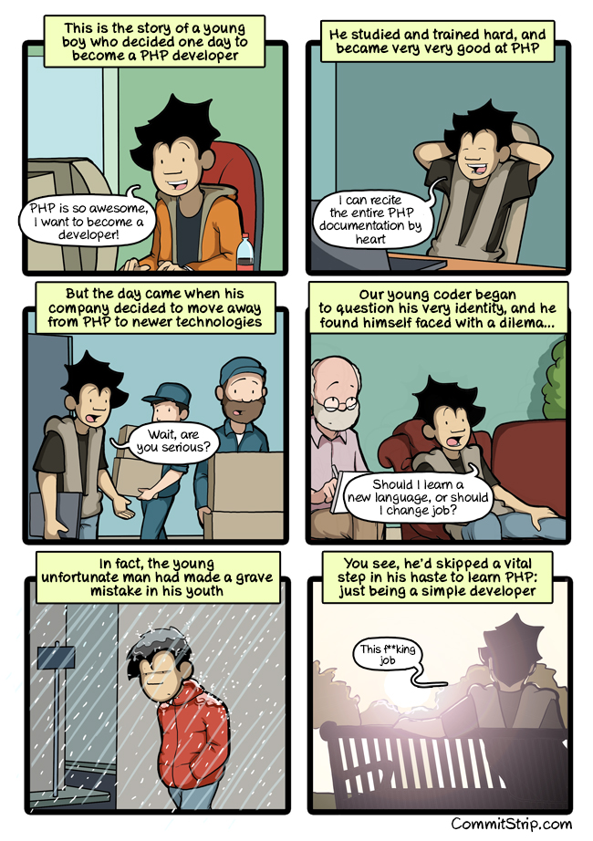

# PHP Fundamentals

Feel free to go to OpenClassroom, Grafikart, Codecademy, Sololearn... **As long as you meet the following learning objectives**.

1. [Learning objectives](./01-learning-objectives.md)
1. [Variables](02-php-variables.md)
1. [Conditional structures](03-php-conditions.md)
1. [Arrays](04-php-arrays.md)
1. [Loops](05-php-loops.md)
1. [Functions](06-php-functions.md)
1. [Form](07-php-forms.md)
1. [GET & POST](08-get-post/)
1. [SESSION & COOKIE](09-session-cookie/)
1. [PDO, form, prepared request...](10-PDO-form/)

