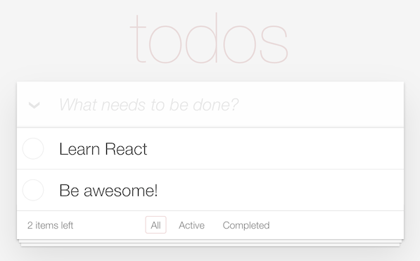

# Your first front-end framework: React

- Repository: `todo-react`
- Mode: `solo`
- Type of Challenge: `learning`
- Duration: `3 days`
- Deployment: `Github pages` or `Netlify`
- Submission form: [Google Form](https://docs.google.com/forms/d/e/1FAIpQLScERmNEvOwbL5QrbcJ5t_83CGfRF9oCvJbEriJcUCn9D3caXw/viewform)

## Learning Objectives

We've talked about a CSS framework like Bootstrap, let's look into a JavaScript one!
At the end of this challenge you will:

- be able to create a new React application
- be able to "think in React"
- be able to use basic hooks for managing state and reactivity
- be able to organize your app in components

## Your mission

This time the task is simple: you will build a small Todo application that lives in your browser, and saves todos even after restarting the browser.

## Useful resources

React introduces a few uncommon concepts that can be difficult to understand at first. Here is a list of useful resources you can refer to - before, during, and after this exercise.

#### Official Documentation

It's well written and made available in many languages.

- Main concepts, starting with simple examples: https://beta.reactjs.org/learn

> Note: Most of the official documentation on _reactjs.org_ is still based on "class components", even though the recommended way forward is "function components". Currently, it's better to follow the _beta.reactjs.org_ because they focus on the "hooks" system, even if the doc is still in _beta_ version. 

#### Online Course

Again, there are a TON of courses out there. The same rule applies: make sure they are recent, and they use functional components and hooks.

- A training given by the University of Helsinki : https://fullstackopen.com/en/#course-contents
- A good, free course in video: https://egghead.io/courses/the-beginner-s-guide-to-react

#### YouTube

There is a TON of React material on YouTube. Choose your own flavor, but make sure that you watch videos that were released recently.

One suggestion, very relevant to this exercise: https://www.youtube.com/watch?v=hQAHSlTtcmY

 > Note: a couple of years ago React went from using mainly "class" based components to mainly "functional" components. Any tutorial that focuses on functional components, and special functions called "hooks" is up to date. Don't waste time on class components, they are the old way.

#### Blogs

Sometimes you will find a good explanation for a specific feature or problem in blogs. These are two blogs that always deliver high-quality content:

- https://kentcdodds.com/blog/
- https://www.robinwieruch.de/blog

## Deliverables

1. Publish the source code on your GitHub repository
2. Deploy the project  
   _Tip if you choose Netlify: to deploy a React app you first run the command `npm run build`, and once the command finishes you will have your app ready in the `build` folder: just drag and drop this folder in Netlify and you are done. Easy!_

## Time to spare?

Have you completed the exercise for the day and don't know what to do with the remaining hours?

- See if someone else needs help.
- Refactor parts you aren't happy with.
- Improve on your project so it's not only a learning repository, but also a show off project when interviewing:
  - Add styling
  - Improve responsiveness
  - Check for little, smooth effects
  - Think UX: what extra features can make your todo app better?
- Rebuild from scratch without any tutorial to improve your understanding.
- Have a live edit option for existing todo's (when you click on the text of a todo, the app allows you to edit it in place).
- Make a version with another JS framework like VueJS or Svelte.

## Good luck!

Ready? Start [here](0.The-Basics/README.md)!

