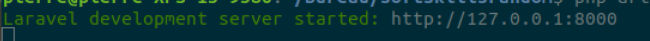

# Composer

> Composer is an application-level package manager for the PHP programming language that provides a standard format for managing dependencies of PHP software and required libraries. 

### 1. Update & upgrade

```terminal
sudo apt update
sudo apt upgrade
 ```

### 2. Install Composer

 ```terminal
sudo apt install composer
```

### 3. Check if it is installed
   
```terminal
composer -v
```

### 4. Choose your directory

```terminal
cd ~ 
cd Desktop
```

### 5. Create a new laravel project using Composer

```terminal
composer create-project --prefer-dist laravel/laravel my-app
```

### 6. Launch your new project

```terminal
cd my-app
php artisan serve
```

Now your app is launched on the port 8000



- [Before](a.introduction.md)
- [Next](../02.TheBasics/readme.md)