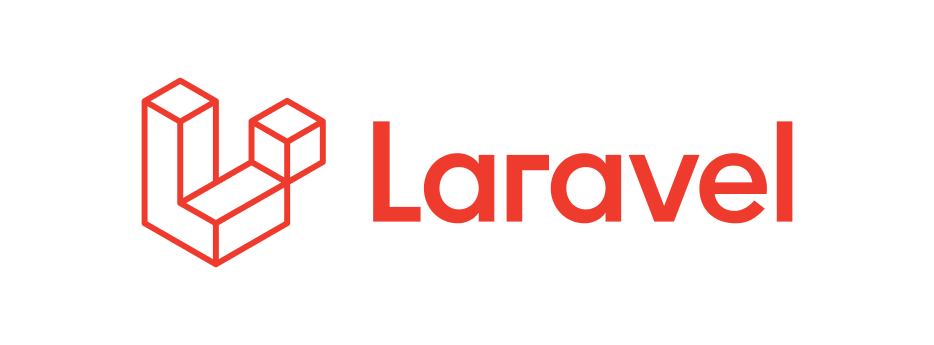

# PHP Laravel

Welcome to Laravel Guide. This tutorial series is designed to provide you with all the informations you need to get started with building a web application using Laravel PHP framework. In this briefing, you will learn What is Laravel? And why we need to use Laravel framework? 

## Prerequisites
- HTML,CSS
- Bootstrap or Tailwind
- PHP (OOP)

### Introduction

1. [Introduction](01.Introduction/a.introduction.md)
2. [Installation](01.Introduction/b.installation.md)

### Step by step
1. [Laravel and its folders & files](02.TheBasics/a.hierachy.md)
2. [Routes](02.TheBasics/b.routes.md)
3. [Views](02.TheBasics/c.views.md)
4. [Controllers](02.TheBasics/d.controllers.md)
5. [Migrations](02.TheBasics/e.migrations.md)
6. [Models](02.TheBasics/f.models.md)
7. [Blade Templates](02.TheBasics/g.blade.md)

### To be continued...
1. [Using tinker](03.Exercice/a.step1.md)
2. [Display data in our views](03.Exercice/b.step2.md)
3. [Create an article](03.Exercice/c.step3.md)
4. [Updade an article](03.Exercice/d.step4.md)

### Challenge
1. [Invoices and so on ...](Challenge)

### Resources
* [The Laravel documentation](https://laravel.com/docs/9.x)
* [Laravel from Scratch on Laracasts](https://laracasts.com/series/laravel-8-from-scratch) (still valid with Laravel 9)
* [Laravel JetStream](https://jetstream.laravel.com/1.x/features/authentication.html)
* [Laravel Livewire](https://laravel-livewire.com/)
* [Laravel Daily Youtube Channel + their Laravel roadmap](https://github.com/LaravelDaily/Laravel-Roadmap-Learning-Path)
* [Tuto FR from Gekkode](https://www.gekkode.com/developpement/tutoriel-laravel-8-pour-les-debutants/)

