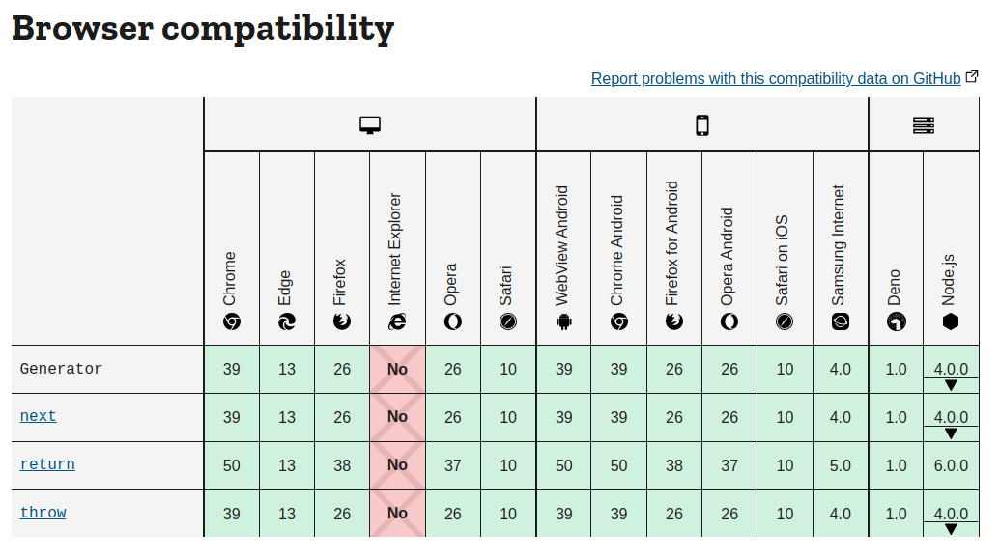
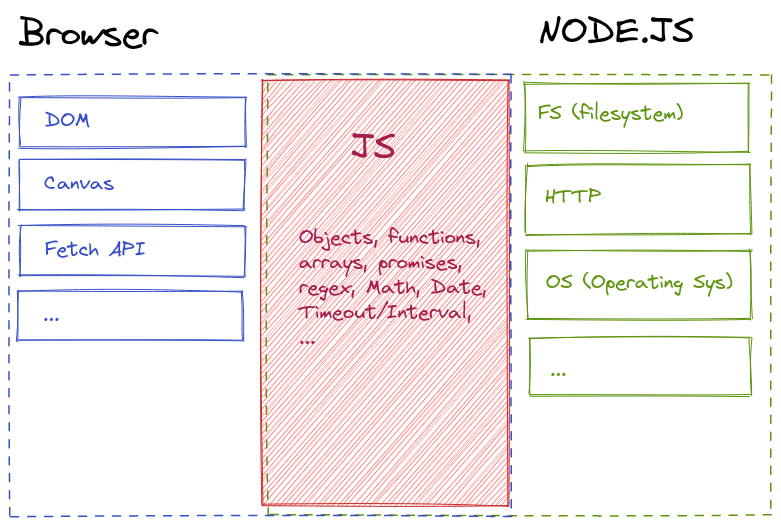
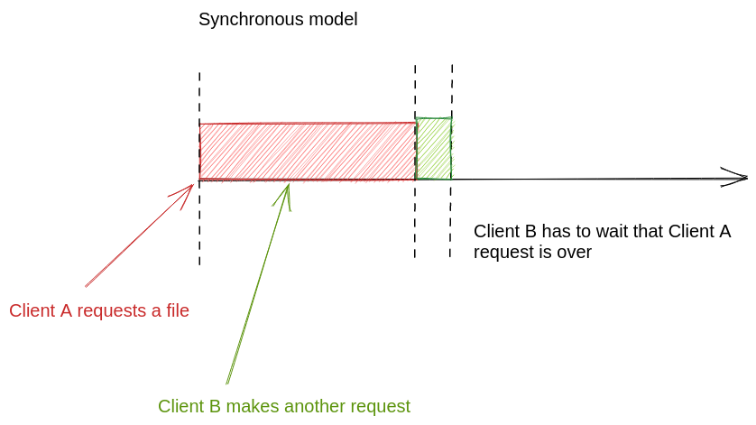
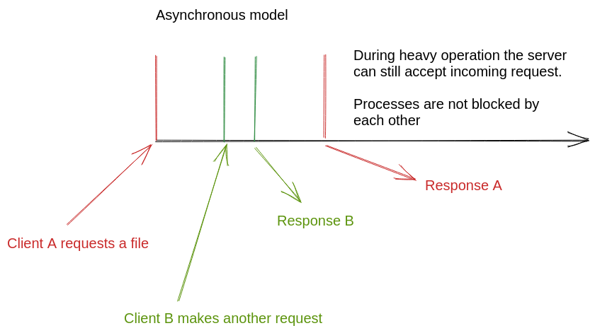

# Getting Started

## What is Node.js ?

Node JS is an open-source JavaScript tool built on Google Chrome’s JavaScript Engine. **It is not a language**, it is Javascript that is executed outside the browser, thus allowing to write server-side code.

When we say that something is written in Node.js, we simply mean that the javascript code is not meant to be run inside an HTML document but rather be executed by the Node.js interpreter.

Beside backend application, some popular tools are written using Node.js (using the Electron framework) such as messaging clients (Discord, WhatsApp, Slack), desktop applications (Visual Studio Code, Figma, ...) and also development tools like the Babbel transpiler (used to translate an input language to Javascript) and many, many more...

## So it's just Javascript? What is the difference with the JS "we already know"?

Node.js and "browser JS" are technically the same thing. These are two interpreter working with the same base language. Not so long ago each browser had their own implementation of the Javascript language, making it hard for developers to keep up. Thankfully those harsh times are almost gone now, but we can still see remnants of these differences on documentation websites such as MDN.

The key difference of Node.js though is that it has no graphical interface, there is no need for a DOM library for instance, since we won't be working with displays. On the other hand, we'll need functions to work with files and databases on our server, hence needing special functions on the backend and that's what Node.js provides.

In summary, Node.js is a terminal based Javascript interpreter with additional functions to work on server-side logic. The browser specific functions have been removed from the Node interpreter. To know if a function is part of the Javascript base language, browser specific or Node.js it is important to know where to find documentation.

- [The list of Browser specific functions on MDN](https://developer.mozilla.org/en-US/docs/Web/API)
- [The list of Node.js base modules](https://nodejs.org/dist/latest-v16.x/docs/api/)

When in doubt, you can always check the compatibility table at the bottom of MDN web docs to see whether that function is implemented in the browser and/or in Node.js.

## Differences with PHP

If you already know a backend language such as PHP, you may be wondering what are the differences between Node and PHP.

First, Node wasn't specifically designed as a web-oriented language, and unlike PHP (whose initial acronym was originally "Personal Home Page") Node is also used in a variety of applications. This may seem like a little difference in essence, but what it really means is that what seems normal in PHP is not necessarily prebuilt in Node.js, and you'll have to code your own server implementation from the ground up (we'll see more about this in the next chapters). This is also true for many other languages with no specific purposes such as Python, C#, Go, Elixir ... so Node is a great entry point to other languages, as you'll learn how HTTP servers work under the hood, and you may be able to replicate this in any language that you like.

This also means that we won't be needing a "LAMP/MAMP/XAMPP/Whatever" stack to run our code. All you need to get started is the node interpreter. Although Nginx is used in really high demanding web applications with tons of users, **Node does not need a server to run on, Node is the server**.

Another notable difference is the philosophy behind each language. Node has a relatively tiny built-in library compared to PHP. There are a lot of useful functions regarding array, string, object manipulation that are not part of the main language, that you'll have to either implement yourself or download as an external module (we'll talk more about that in the future). In fact most of the Node.js code that runs in production was made by open-source contributors and is not part of the main officially maintained language. This could lead to, worst case scenario, security breach, more commonly, odd behaviors in your apps. One thing you'll learn using Node.js is the importance of automated testing.

There are also differences on the languages themselves, beyond their syntax, one thing that will be key is that Javascript is **asynchronous** and **event driven**. The server will run as a background task and catch events (requests) and execute them in a queue, while PHP is synchronous by nature and runs on multiple threads. Node.js makes a great tool for handling lightweight concurrent request, but falls behind when faced with heavy computation tasks (Image Manipulation for instance).

Let's look at an example.

> Let's say we have to open a huge JSON file for one specific user, this operation could take several precious milliseconds, and we still want our server to react to other incoming requests during that time.

## So when and why should we use Node.js ?

This, of course, depends on your project. Node.js can be either really fast or really slow depending on your use case.

Beside the speed of execution we should also consider the speed of development, and you should know that Node.js has a steeper learning curve than PHP, although when mastered, you'll be able to bootstrap projects in no-time.

The best use-case for Node.js are:

- REST APIs (that's what we'll put our focus on)
- Realtime application using sockets (Geo asset tracking, chat application, online games)
- Messaging App Bots (ex: Discord)
- Anything that's not strictly web-related (ex: Desktop application), without learning a new language.

... last but not least, you can of course also create "traditional" websites using Node.

One last question to ask yourself before diving in is also really simple: Do you like Javascript? And do you want to get better at it? Node.js is a great way to improve your javascript skills as the Node interpreter is strict by default, enforcing good practices. Learning Node.js will allow you to become a better JS programmer.

## What's next?

So you think this is what you were looking for?

**Let's jump into the nodeverse to [setup Node and run our first application!](../2.Our-First-App/)**

