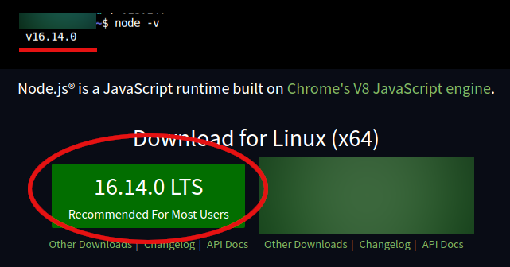
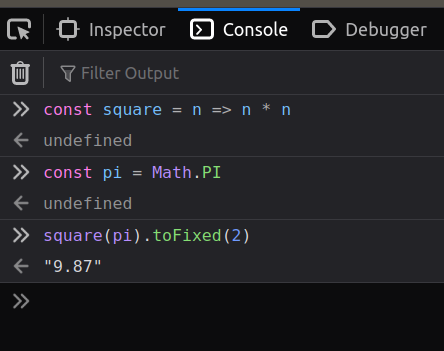
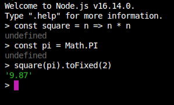
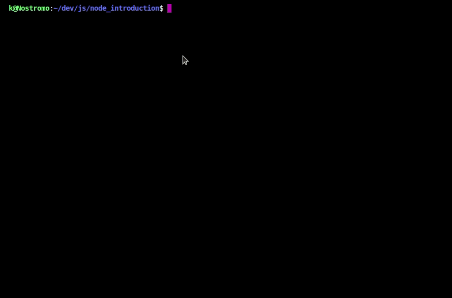

# Our first Node.js application

## Setup and installation

First and foremost let's install Node.js on our computer. ([If you'd like to keep a clean environment, you can also run Node.js inside a docker container](https://hub.docker.com/_/node), I do not recommend this option as a starting point though).

Setup will heavily depend on your operating system. We will need to install both Node and its package manager `NPM`.

### Ubuntu

On Ubuntu Linux the following command should suffice:

```
sudo apt install nodejs npm
```

### MacOS

On MacOS the easiest way to install Node.js is through homebrew:

```bash
brew install node
```

### Windows and other OS

You can head over to the [Node.js download page](https://nodejs.org/en/download/) to get the latest installer, and follow the instructions.

## Updating to the latest version

If you installed Node through a package manager, it is important to check that the version you are running is not obsolete. I recommend using the `LTS` (Long Term Support version), which means the latest stable release of the program.

Another thing worth noting is not to use an odd number version (ex: v11, v13, v15, v17, ...), those versions are experimental, and the **stable version will always be an even number**.

Once Node is installed you'll be able to check its version by typing `node -v` in a terminal.

The easiest way to get the LTS version is by using the `n` command.

```bash
# install the n package globally
sudo npm -g i n

# prompt the n executable to install the LTS version
sudo n lts
```

Close and reopen your terminal, your local Node version should now be LTS.


_Hurray I've got the LTS version!_

## Using Node.js

### Running code in REPL mode

Once you got Node installed with the latest version, you can launch the program in REPL mode (Read Eval Print Loop, also known as interactive mode). This will allow you to use JS code directly in your terminal, just like you would execute code in the browser Javascript console.

To do this, simply enter the following command in your terminal

```bash
node
```

| The browser console                  | The node terminal               |
| ------------------------------------ | ------------------------------- |
|  |  |

This is fine for testing quick javascript statements but is not very useful for doing more complex stuff.

### Executing a file

You can also tell the Node.js interpreter to execute a file. To do this simply create a new file with the `.js` (or preferably `.mjs`) file extension and then run:

```
node [path.to.your.file].mjs
```

## Legacy code warning

Before going any further, it is important to know that Node.js has a complex history of standardization. Just like its browser counterpart some legacy features are still present in the language so that the compatibility with older codebase is maintained.

When looking for some documentation online you might find several ways of achieving the same result. Below you'll find two example of this phenomenon.

### ES6 imports vs `require()` (`js`/`.mjs`)

Modules allow you to break your code into multiple files and are an essential part of Node.js. A module could mean three different things:

- One of the base library function, such as the File System (`fs`) or `HTTP` package
- A javascript file that you wrote with functions exports. To refer to this file we'll call it with a preceding `./`. For instance let's say you have a file called `helpers.mjs` that you'd like to use from another file in the same working directory, we shall refer to it using `./helpers.mjs`.
- An external dependency installed via NPM, that will be stored in a `node_modules` folder at the root of your project. In this case we don't need to prefix it with a slash

Looking at some example online you might stumble upon the `require()` function. This **was** the standard way of importing modules in earlier Node.js versions. [However since 2020 this syntax is now discouraged in favor of the `import/export` paradigm](https://stackoverflow.com/a/31367852/8031029).
To use the "new" syntax, you'll have to use the `.mjs` file extension.

If you already used a frontend module bundler, you should be familiar with the latter.

|                                                       | ES Modules **(recommended)**                                     | CommonJS (= `require()`)                                                         |
| ----------------------------------------------------- |------------------------------------------------------------------| -------------------------------------------------------------------------------- |
| **File extension**                                    | `.mjs` files                                                     | `.js` files                                                                      |
| **Exporting**                                         | `export` keyword before a variable/function you'd like to export | a single `module.exports = {}` statement with an object containing named exports |
| **Importing a named export from a local module**      | `import { name } from './file.mjs'`                              | `const { name } = require('./file.js')`                                          |
| **Importing a named export from an installed module** | `import { name } from 'module-name'`                             | `const { name } = require('module-name')`                                        |

You can find more info about the [ES Modules syntax on MDN](https://developer.mozilla.org/en-US/docs/Web/JavaScript/Reference/Statements/import).

### Callbacks and async/await

We mentioned earlier that Node.js is an asynchronous language, it involves a mechanism called the "event loop" under the hood ([there's an in-depth article which explains it here](https://towardsdev.com/event-loop-in-javascript-672c07618dc9)). We won't go into the implementations details here, but there is one important implication of asynchronicity to remember, **we should never write "blocking code"**, doing so will block the server for all the users.

Just like with modules, there is a legacy syntax and newer one. Both work just fine, but the async/await model is now preferred over the callback schema.

These two functions do the same thing (open a file called `hugegile.txt`, allow operations while the file loads then, when the file is ready, log its content in the console):

```javascript
// Callback syntax
import { readFile } from "fs";

const readLogs = () => {
  readFile("hugefile.txt", "utf-8", (err, file) => {
    // This is a callback function
    // It is called when the file is ready
    if (err) console.log("There was an error", err);

    console.log(file);
  });
};

// Async/Await syntax
import { readFile } from "fs/promises";

// The whole function is blocked, but the rest of the program is still running
// Thanks to the "async" keyword
const readLogs = async () => {
  try {
    // The "await" statements below means that the next line
    // wont be executed until the operation is over
    const content = await readFile("hugefile.txt", "utf-8");
    console.log(content);
  } catch (err) {
    console.log("There was an error", err);
  }
};
```

You'll notice that both pattern coexist, but the first one is slowly becoming obsolete. You'll find non-blocking operation in a whole range of use-case such as file-manipulation, DB transaction, cryptographic operation, ...

More about this in the official docs:

- [Blocking vs Non Blocking code](https://nodejs.org/en/docs/guides/blocking-vs-non-blocking/)

## TL;DR :

You can execute Javascript code, using the `node` command, followed by a filename. It is recommended to use the standard `ES Modules` syntax in your code, you'll need to use the `.mjs` file extension.

Node.js is asynchronous by nature, the traditional way of dealing with this is using [callback functions](https://nodejs.dev/learn/javascript-asynchronous-programming-and-callbacks), although more convenient modern methods now exist such as [Promises](https://nodejs.dev/learn/understanding-javascript-promises) and [async/await](https://nodejs.dev/learn/modern-asynchronous-javascript-with-async-and-await)

## Exercises

Here are a list of exercises you can do to self assess your Node.js knowledge so far. Take some time to try those before going any further.

### Exercise 1

Create two files:

- `functions.mjs` which should export a function called `greetingsOfTheDay()`. This function takes no parameter and should return a string in the form of `Today we are Monday, first day of the week` (which should of course depend on the current day). Use the standard [Date Object](https://developer.mozilla.org/en-US/docs/Web/JavaScript/Reference/Global_Objects/Date).
- `index.mjs` which will import your function and logs the result (`console.log(greetingsOfTheDay())`). launch this file using `node index.mjs`

### Exercise 2

Use the [native filesystem (fs) module](https://nodejs.org/docs/latest/api/fs.html) to create or update a `log.txt` file, so that each time you call your `greetingsOfTheDay()` function it adds a new line with the date and time the function was called (ex: `Function called on 2022-02-15T12:44:13.981Z`)

### Exercise 3

Use [process.argv](https://nodejs.org/docs/latest/api/process.html#processargv) to retrieve the arguments passed to the Node.js program so that when you call `node index.mjs filename.txt`, the `filename.txt` (or any other string that is passed using the terminal) becomes the logs file you'll write to.

The end result of these exercises should look somewhat like this.


That's all for this section, but now you may be wondering, when are we going to do some real backend shenanigans ? [The next chapter should cover that up!](../3.Launching-A-Server/)
