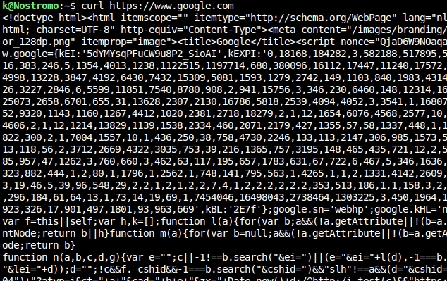
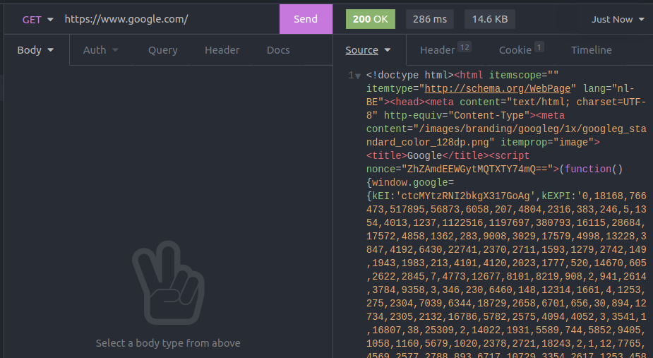
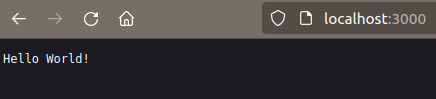
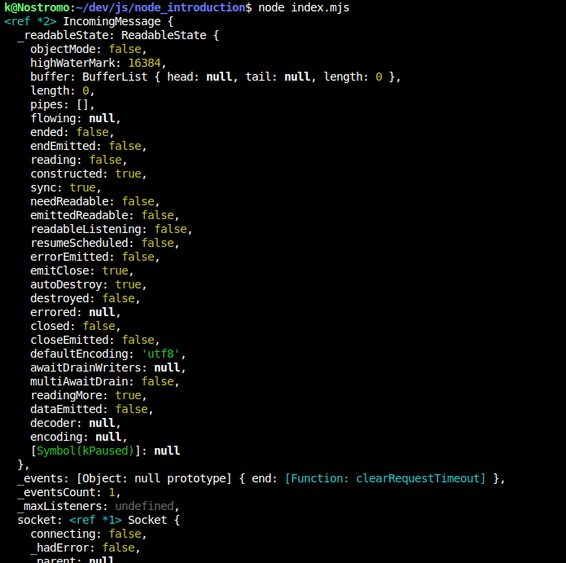
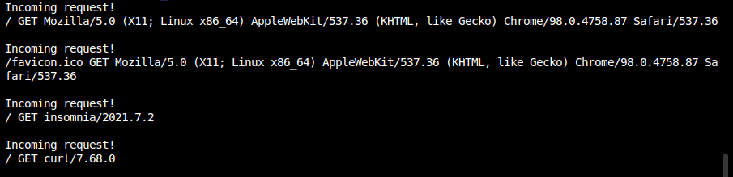

# Our first HTTP server

We now know what Node.js is, and how to run code. But there is a missing piece of the puzzle.

So far we still need to run our program manually, and each time the task we designed is finished, the program exits, which isn't that useful. In this section we're going to set up our first HTTP server, a program that does not shut down after it is finished but rather stays open to "listen" for incoming tasks : a backend.

## But first, what is HTTP ?

`Hyper Text Transfer Protocol` (or HTTP in short) is a standard way of communicating information between a `client` and a `server`, the **client will send a request** and the **server will send a response**. The role of the server will be to centralize every incoming requests; an important concern of backend development is that there are multiple clients talking to the same server.

A client could be anything that sends request to the server, the most basic example is a web browser running a website but there are many other types of client :

- **Mobile apps** (ex: TEC/De Lijn app, Uber eats, ...)
- **Desktop apps** (ex: Discord, Firefox Browser, ...)
- **IoT clients** (ex: digital display at bus stops, smartwatches, ...)
- **GUI Tools** (ex: Postman, Insomnia)
- **Terminal based tools** (ex: cURL)

A common request/response scenario would be to use your browser to get [wikipedia](https://wikipedia.org)'s landing page. After typing in the URL in the address bar when you'll hit `Enter`, your browser will send a **GET** request to the wikipedia server which will respond with an **HTML webpage**. It's as simple as that!

HTML documents are just one type of response, other types of response may include :

- **Assets** (pictures, js or css files, favicons)
- **API response** (JSON, XML or text based response)
- **Other type of binary file** (video, audio, pdf, or any other file that cannot be read directly from a webpage)

For a more in-depth guide of what HTTP is, [you can check this overview of the protocol on MDN](https://developer.mozilla.org/en-US/docs/Web/HTTP/Overview).

## Choosing an HTTP client

A browser is a fine option for communicating with your server. However, it is not the best tool when it comes to backend creation and testing.

Beside the basic **GET** request, there are request involving sending data from the client to the server, using a form for instance.

There's where other clients come handy. Here is an example of fetching the same page, using 3 different clients:

| Web Browser (Firefox)     | cURL                | Insomnia                  |
| ------------------------- | ------------------- | ------------------------- |
|  |  |  |

We're going to make heavy use of the [Insomnia client](https://insomnia.rest/) (or alternatively [Postman](https://www.postman.com/downloads/)), this tool will allow us to shape custom requests more easily.

If you have never used such a tool, take some time to fiddle around with it a bit before getting to the next part.

## The Node HTTP module

So that was for the frontend part, now how does it work on the other side?

### The basic boilerplate

We don't need to write much, in fact, just the following lines of code should get you started.

```js
import { createServer } from "http";

const server = createServer((request, response) => {
  response.end("Hello World!");
});

server.listen(3000);
```

Put them in a `.mjs` file and execute it using Node. You'll notice right away that your terminal is put on hold. The Node.js process will continue to run until you shut it down manually. Now head over to your browser, and go to [http://localhost:3000](http://localhost:3000) where these two magical words may appear.



So what have we done here :

- First we import the [`createServer` method from http](https://nodejs.org/dist/latest-v16.x/docs/api/http.html#httpcreateserveroptions-requestlistener) package.
- This method takes a function as an argument, this function is called a `request listener` and takes two arguments:
  - A `request` argument which will contain all the information about the client request (ip address, url requested, method, ...)
  - A `response` argument which we will use to return our server response
- At the end of the script we tell our server to `listen` to all incoming events on port `3000` (could be any value), so that our app remains open.

Let's take a closer look at our `request listener`, as we said this function gets executed everytime there is an incoming request to our server, and allow us to send an appropriate response... but what is a request made of?

### The `request` argument

A simple and effective way to determine what a request actually is, is to `console.log()` it! Let's modify our `server`:

```javascript
const server = createServer((request, response) => {
  console.log(request);
  response.end("Hello World!");
});
```

If we head over to our terminal, after making a request, we might see this big chunk of text appear. It's all we know about our request. Of course this may seem like a lot of information, and we probably don't need all of them.



So to spare us time, let's focus on 3 more used parameters :

- The request URL
- The request method, usually `GET` (could be `POST`/`PATCH`/`PUT`/`DELETE` when working with dynamic content update)
- The [request headers](https://developer.mozilla.org/en-US/docs/Web/HTTP/Headers) containing information about the client

```javascript
const server = createServer((request, response) => {
  console.log("incoming request");
  console.log(request.url, request.method, request.headers["user-agent"]);

  response.end(`You attempted to reach ${request.url}`);
});
```


_Logging my requests with 3 different client gives me this_

Extracting the base components of a request is the core of HTTP servers, it is the very essence of what a backend developer should do : creating an interface that responds accurately to a request.

Over the years, these means of communication got standardized. A common pattern has appeared, which is colloquially known as **routing**. Simply put.

> A route is a combination of a method and an url. When I use my browser to load `http://somesite.com/page-1.html`, I expect to get the content of `page-1.html` located on `somesite.com`

A basic routing example could be this. A server that returns `ping` when the [http://localhost:3000/pong](http://localhost:3000/pong) is loaded, and vice-versa. If the route is not one of these two options it returns a basic HTML documents.

```javascript
const server = createServer((request, response) => {
  const { url } = request;

  if (url === "/ping") response.end("pong");
  else if (url === "/pong") response.end("ping");
  else {
    response.setHeader("Content-Type", "text/html");
    response.end(`
    <p><a href="/ping">go to /ping</a></p>
    <p><a href="/pong">go to /pong</a></p>
  `);
  }
});
```

### The `response` argument

Similarly to the `request` argument, the `response` argument gives us a way to shape the things we return to our client.

For instance, we'd like to inform on the type of response we are providing. We could also return a status code for our response, it is a 3-digit number that gives a broad explanation of your response content . The most common and default one, if everything went well, is the `200` (ok) status. You might have encountered some other status code in the past, such as the infamous `404` (not found) status, or the `500` (internal server error), but there are many more available to the list.

Let's say we have an API, and we're trying to access a route that's only available to authenticated users. We can do it like so:

```javascript
const server = createServer((request, response) => {
  // some other routes ...
  // ...

  if (request.url === "/api/protected-route") {
    // We specify that the return value will be JSON
    response.setHeader("Content-Type", "application/json");

    // We will cover authentication in the next sections
    // For the sake of this example let's assume that the "isAuthenticated" function
    // returns true if a user is logged in and false otherwise
    if (isAuthenticated()) {
      // We return a response in the JSON format
      // We don't need to specify a status, here it will be default (200)
      return response.send(JSON.stringify({ info: "You are logged in" }));
    }

    // We add the "403" (forbidden) status code to our response
    response.statusCode = 403;
    return response.send(
      JSON.stringify({ info: "You cannot access this resource" })
    );
  }

  // ...
});
```

- [List of common MIME types for responses](https://developer.mozilla.org/en-US/docs/Web/HTTP/Basics_of_HTTP/MIME_types/Common_types)
- [List of HTTP statuses](https://developer.mozilla.org/en-US/docs/Web/HTTP/Status)

## TL;DR:

A server is a program that listens to incoming HTTP requests and serves a relevant `response`. The request can be separated into different `routes` (= a url + a method) and the response can be more than just a HTML document (image, css file, json, text, ...), hence the need of headers that will describe both the request and response content.

You can also check this older guide ["anatomy of an HTTP transaction"](https://nodejs.org/en/docs/guides/anatomy-of-an-http-transaction/) on the official Node.js docs.

## Exercises

These exercises should give you a first-hand experience on how to manage an HTTP server.

You don't need to use external NPM dependencies, the base `http` package, and the base Javascript library should suffice.

Take some time to tackle those before moving on to the next chapter. Do not hesitate to ask for hints if you feel blocked.

### Exercise 1

Get back to the script you wrote in the previous section. Create a new HTTP server with a `/greet` route.

When you browse to [http://localhost:3000/greet](http://localhost:3000/greet) the server returns the `greetingsOfTheDay()` as a response.

### Exercise 2

Each time you do a request to the server, log the following information in a separate `logs.txt` file:

- The date and time of the request
- The requested URL
- The requested method

ex:

```
[2022-02-17T14:02:56.226Z] GET /greet
[2022-02-17T14:02:57.812Z] GET /
[2022-02-17T14:03:12.001Z] GET /clock
```

### Exercise 3

If you head over to [http://localhost:3000/](http://localhost:3000/) (the `/` route), the server should respond with how many seconds have passed since you started the server.

### Exercise 4

Create a new GET route called `/clock`, which resets the timer from the previous exercise

### Exercise 5

Create a new GET route called `/routes` which will respond with the following image. You can now include this picture in an `` tag on one of your other routes (... or not, well it's your server after all)


### Exercise 6

Create a condition to return a 404 status page for every route that is not defined above.

## What's next?

Now that you have a clearer understanding of the request/response model, let's move on to the [next chapter](../4.Express/) where we'll uncover the Express framework to write routes more effectively.
