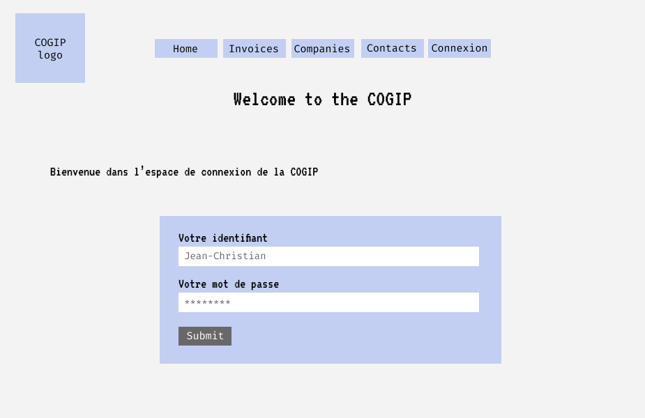

# Mock-ups for the COGIP

[Link to the mock-up on figma](https://www.figma.com/file/a6ZDqTpKH2OttTQkJ3ujg2i2/COGIP-App?node-id=0%3A1)

## Users (not logged in)

### Welcome

### Lists

#### Contacts

#### Invoices

#### Companies

### Details

#### Contacts

#### Invoices

#### Companies

## Login

## Jean-Christian super admin is connected

### Dashboard administration

Note that you can directly delete elements from this dashboard.

Menu for the administrators. Note that you can log out.

### Adding page

#### New contact

#### New invoice

#### New company

