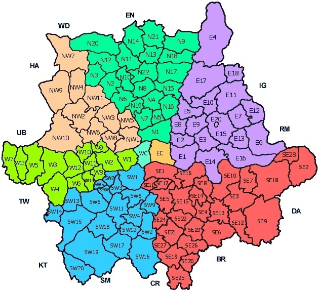

# 01 - Simple

## Validate the form

Your new website collects data about Londonian users. In order to receive their personal information
(and store them safely in accordance with the GDPR laws), you need to create a form on which they will fill in their
email address, postal code and phone number.

### Email address
The email address is handled by the browser, since the format is standard anywhere you live in the world. Note, you can
consult [this website](http://emailregex.com/) if you want to know more about email regexes.

### Post Code
Regarding the postal code, London uses specific types of patterns : 
* A(A)9(9) 9AA

Know that the first group of characters is based on the area in London. You can find a map with all the possible combinations below :

The last three characters are always a number and two letters.

### Phone number

For the phone number, you need to allow the London-area as well as UK mobile phones.

The patterns to allow are : 
* 020 xxxx xxxx 
* 07xxx xxx xxx
* +447xxx xxx xxx
* 00447xxx xxx xxx

## Your mission

You mission here is simply to deliver two regexes that can be used in this form, one for the postcode and one for the 
email address.
